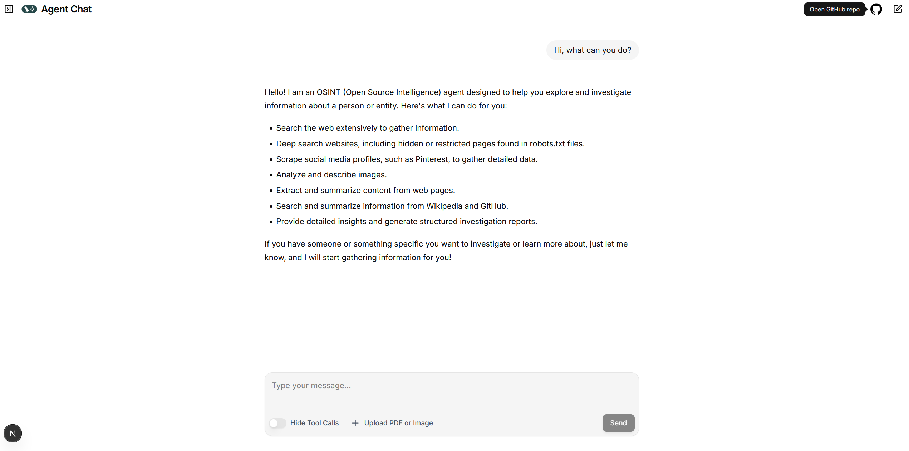

# OSINT Investigator Agent

An Open Source Intelligence (OSINT) agent built with LangGraph. It investigates people, websites, and cases using web search, deep site crawling, Pinterest scraping, Wikipedia/GitHub lookups, image description, and other tools. Run it as a LangGraph server and use the [Agent Chat UI](docs/agent_chat_ui_setup.md) or any LangGraph client to chat.

## Prerequisites

- **Python 3.11** (see `src/langgraph.json`)
- **OpenAI API key** (for the LLM and image description)
- Optional: **Node.js** and **pnpm** if you want to use the [Agent Chat UI](https://github.com/langchain-ai/agent-chat-ui) (see [docs/agent_chat_ui_setup.md](docs/agent_chat_ui_setup.md))

## Installation

### 1. Clone the repository

```bash
git clone https://github.com/binh120702/osint-agent.git
cd osint-agent
```

If you use the optional [Agent Chat UI](docs/agent_chat_ui_setup.md) submodule: `git submodule update --init --recursive` (see that doc for Node/pnpm and running the UI).

### 2. Create a virtual environment and install Python dependencies


**Install from version ranges only**:

```bash
python -m venv .venv
.venv\Scripts\activate
pip install -r src/requirements.txt
```

### 3. Environment variables

Copy the example env file and set your OpenAI key:

```bash
cp src/.env.example src/.env
# Edit src/.env and set OPENAI_API_KEY=sk-...
```

If there is no `.env.example`, create `src/.env` with:

```env
OPENAI_API_KEY=sk-your-key-here
```

## Running the agent

Start the LangGraph server from the **`src`** directory:

```bash
cd src
langgraph dev
```

- Server: **http://localhost:2024** · Graph ID: **osint_agent**

Use the [Agent Chat UI](docs/agent_chat_ui_setup.md) (submodule) or any LangGraph client to chat.

Example chat UI:



---
## Project structure

```
osint/
├── README.md                 # This file
├── src/
│   ├── main.py               # LangGraph graph (osint_agent)
│   ├── langgraph.json        # LangGraph config
│   ├── requirements.txt      # Python dependencies (version ranges)
│   ├── requirements.lock    # Exact pins for reproducible installs
│   ├── prompts.py
│   ├── llms/                 # LLM client (OpenAI)
│   ├── tools/                # Agent tools + osint_multimedia (EXIF, image AI detection)
│   └── crawlers/             # Web content, Wikipedia, GitHub (from kmap reference)
├── agent-chat-ui/            # Optional Next.js UI (submodule)
└── docs/
    ├── agent_chat_ui_setup.md
    └── ...
```