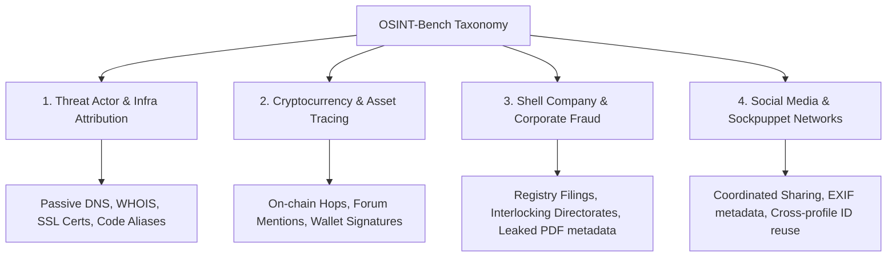

# OSINT-Bench: An End-to-End Benchmark for Agentic AI in OSINT Investigations

OSINT-Bench is an evaluation benchmark designed to measure the capabilities of Agentic AI systems and individual NLP/reasoning modules on realistic, end-to-end Open Source Intelligence (OSINT) investigations. 

Unlike existing benchmarks that focus on isolated sub-tasks (e.g., question answering, entity extraction, or API tool calling), OSINT-Bench evaluates an agent's ability to discover relationships, perform multi-hop reasoning across heterogeneous data sources, resolve logical contradictions, and generate structured, traceable investigative reports.

---

## 1. Motivation & Philosophy

Most academic and industry benchmarks evaluate OSINT tools on:
1. **Entity Extraction**: Identifying IPs, emails, or names in text.
2. **Threat Classification**: Labeling malware or domains as malicious/benign.
3. **Simple Lookup**: Retrieving information that can be found via a single search engine query or database lookup.

In contrast, a professional OSINT analyst executes a workflow that is iterative, cross-source, and deeply logical. They must:
- Formulate hypotheses and pivot based on new clues.
- Link entities across disparate platforms (e.g., matching a PGP key signature to a forum handle to a domain registrar).
- Reconcile conflicting or deliberately deceptive information (e.g., identifying when WHOIS registration dates contradict public blog posts).
- Produce a report where every finding is tied to an explicit trace of verifiable evidence.

**OSINT-Bench** bridges this gap by providing structured, reproducible evaluation cases that simulate realistic investigative scenarios with objective ground-truth graphs.

---

## 2. Benchmark Taxonomy

We classify OSINT investigations into four high-value research categories that require varying styles of reasoning and data collection:



### Supported Categories

| Category | Description | Primary Data Sources | Reasoning Requirements |
| :--- | :--- | :--- | :--- |
| **1. Threat Actor & Infra Attribution** | Tracing malicious infrastructure (domains, IPs, servers) back to physical personas or developer aliases. | WHOIS histories, SSL/TLS certificate transparency logs, Passive DNS, public code repositories (Git commits, SSH keys). | Cross-source entity linking, SSH/PGP key matching, time-zone alignment analysis. |
| **2. Cryptocurrency & Asset Tracing** | Tracking stolen assets or illicit transaction flows to associate pseudonymous addresses with real-world identities. | Public blockchain ledgers (BTC/ETH), developer forums, darknet market archives, public wallet listings. | Transaction graph pathfinding, matching timestamp patterns, reconciling public alibis with on-chain reality. |
| **3. Shell Company & Corporate Fraud** | Investigating front companies, evasion tactics, and proxy director networks. | Corporate registries, leaked registry PDFs, court archives, business listing platforms. | Document parsing, relationship extraction, extracting and matching interlocking directorates. |
| **4. Social Media & Sockpuppet Networks** | Identifying coordinate influence campaigns, sockpuppets, or leaked operational security (OpSec) metadata. | Social graphs, profile metadata, photo/media files, archiving platforms. | Image geolocation, EXIF metadata extraction, profiling linguistic patterns, identifying shared infrastructure. |

---

## 3. Core Architecture

OSINT-Bench models each investigation case using a deterministic schema that splits the case into **Ingress (Public Information Sources)** and **Egress (Expected Output & Ground Truth)**.

```
+-------------------------------------------------------+
|                    INVESTIGATION CASE                 |
+-------------------------------------------------------+
|  [Case Metadata] ID, Goal, Category, Target, Diff     |
|                                                       |
|  [Public Sources] Curated Web/DB snapshots            |
+--------------------------+----------------------------+
                           | (Agentic AI Under Test)
                           v
+--------------------------+----------------------------+
|  [Ground Truth Graph]                                 |
|   - Expected Entities (Nodes)                         |
|   - Expected Relations (Edges)                        |
|   - Contradictions & Reasoning Proof Chains           |
|   - Objective Target Answers                          |
+-------------------------------------------------------+
```

Each case is defined in a JSON file containing:
- **`sources`**: A sandbox or mocked set of reproducible web pages, API endpoints, or database tables.
- **`ground_truth`**: A graph structure containing the nodes, relations, and proof chains that must be traversed to solve the goal.
- **`contradictions`**: Deliberate anomalies in the source data that the agent must identify and flag.

---

## 4. Repository Structure

The repository is structured as follows:

```
├── README.md                      # This file
├── evaluation_protocol.md         # Detailed metrics and ablation procedures
├── dataset_guidelines.md          # Guidelines for contributing new cases
├── schema/
│   └── case_schema.json           # JSON Schema validator for cases
├── cases/
│   ├── case_001_infrastructure.json # Threat Actor Infrastructure Attribution case
│   ├── case_002_cryptocurrency.json # Cryptocurrency / Ransomware tracking case
│   └── case_003_shell_company.json  # Shell Company proxy director case
└── scripts/
    └── validate_cases.py          # Script to validate cases against schema
```

---

## 5. Getting Started

### Prerequisites

To validate the benchmark schema and run compliance checks, you will need Python 3.8+ and the `jsonschema` library:

```bash
pip install jsonschema
```

### Validating the Dataset Cases

Run the automated case validator to ensure all JSON definition files conform to the standard case schema:

```bash
python scripts/validate_cases.py
```
